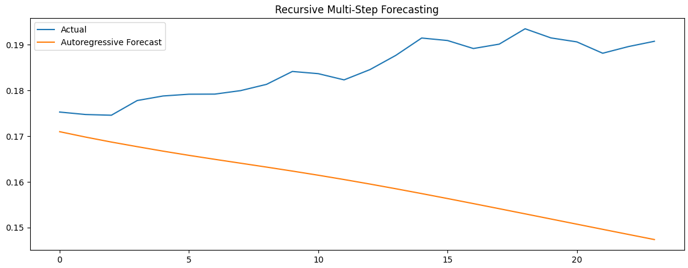
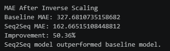
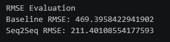
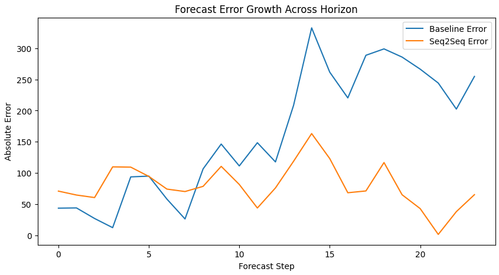
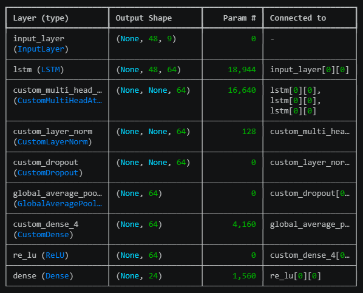
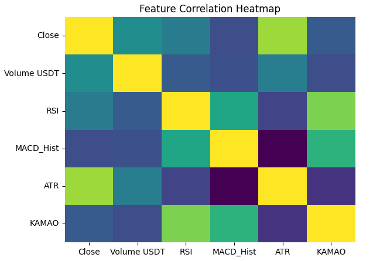

# ₿ Bitcoin Price Forecasting using Seq2Seq Deep Learning

### Multivariate Multi-Horizon Time Series Forecasting with TensorFlow

<p align="center">


</p>

---

## 🎯 Project Summary

This project implements a deep learning-based Bitcoin price forecasting system using a Sequence-to-Sequence (Seq2Seq) architecture enhanced with Teacher Forcing and Multi-Head Attention.

The proposed model was benchmarked against a baseline LSTM forecasting model to evaluate its effectiveness for multi-horizon forecasting tasks.

### Key Result

🚀 **50.36% MAE Improvement over Baseline LSTM**

| Metric | Baseline LSTM | Seq2Seq |
| ------ | ------------- | ------- |
| MAE    | 327.68        | 162.67  |
| RMSE   | 469.40        | 211.40  |

---

## 🚀 Project Highlights

✔ Built a custom Seq2Seq Encoder–Decoder forecasting architecture

✔ Implemented Teacher Forcing for stable sequence generation

✔ Developed a custom Multi-Head Attention mechanism

✔ Designed custom TensorFlow training loops using GradientTape

✔ Achieved 50.36% lower MAE compared to a baseline LSTM model

✔ Performed multi-horizon forecasting and horizon degradation analysis

✔ Benchmarked advanced forecasting architectures against traditional recurrent models

---

# 📈 Forecast Visualization

The figure below compares actual Bitcoin prices against predictions generated by the proposed Seq2Seq model.



The model successfully captures long-term market trends while maintaining forecasting stability across future horizons.

---

# 📊 Model Performance Comparison

### Mean Absolute Error (MAE)



### Root Mean Squared Error (RMSE)



The Seq2Seq architecture consistently outperformed the baseline LSTM model on both evaluation metrics.

---

# 🔍 Horizon Error Analysis

To assess forecasting robustness, prediction errors were evaluated across multiple forecasting horizons.



This analysis provides insight into model degradation behavior as the prediction horizon increases.

---

# 🏗 Model Architecture Comparison

To evaluate architectural improvements, a baseline LSTM forecasting model was compared against a more advanced Seq2Seq Encoder–Decoder architecture.

---

## Baseline Architecture (LSTM)

The baseline forecasting model uses a conventional LSTM-based architecture for multi-step prediction.



### Characteristics

* LSTM Network
* Sequential Forecasting
* Multi-Horizon Output
* Baseline Benchmark Model

---

## Proposed Architecture (Seq2Seq + Attention)

The proposed architecture introduces an Encoder–Decoder framework combined with Teacher Forcing and Multi-Head Attention.


### Components

* Encoder Network
* Decoder Network
* Teacher Forcing
* Multi-Head Attention
* Layer Normalization
* Dropout Regularization
* Weighted Horizon Loss

### Architecture Flow

Input Sequence → Encoder → Multi-Head Attention → Decoder → Multi-Horizon Forecast

---

# 📂 Dataset

The project uses historical Bitcoin market data containing multiple numerical variables for forecasting future price movements.

### Data Processing Pipeline

* Data Cleaning
* Feature Engineering
* Correlation Analysis
* Seasonal Decomposition
* ACF Analysis
* PACF Analysis
* Feature Scaling
* Sequence Windowing
* TensorFlow Dataset Pipeline

---

# 📊 Correlation Analysis

Correlation analysis was performed to identify relationships among market variables before model training.



This step supports exploratory data analysis and feature selection.

---

# ⚙️ Training Strategy

## Baseline Model

* LSTM Forecasting Network
* Multi-Horizon Output
* Custom Training Loop

## Advanced Model

* Seq2Seq Encoder–Decoder
* Teacher Forcing
* Multi-Head Attention
* Layer Normalization
* Dropout Regularization
* Weighted Horizon Loss

## Optimization

* Adam Optimizer
* TensorFlow GradientTape
* Custom Training Loop
* Validation Monitoring

---

# 📈 Evaluation Methodology

The forecasting models were evaluated using:

* Mean Absolute Error (MAE)
* Root Mean Squared Error (RMSE)
* Recursive Forecasting
* Multi-Step Prediction
* Prediction Comparison
* Horizon Error Growth Analysis
* Forecast Visualization

---

# 🧠 Skills Demonstrated

### Machine Learning & Deep Learning

* Time Series Forecasting
* Deep Learning
* Sequence Modeling
* Multi-Step Forecasting
* Attention Mechanisms
* Encoder–Decoder Architectures

### TensorFlow

* TensorFlow
* GradientTape
* Model Subclassing
* Custom Layers
* Custom Training Loops

### Data Science

* Feature Engineering
* Exploratory Data Analysis
* Correlation Analysis
* Statistical Decomposition
* Forecast Evaluation
* Model Benchmarking

---

# 🛠 Tech Stack

* Python
* TensorFlow
* NumPy
* Pandas
* Matplotlib
* Seaborn
* Scikit-Learn
* Statsmodels

---

# 📁 Repository Structure

```text
bitcoin-price-forecasting-seq2seq/
│
├── assets/
│   ├── forecast_vs_actual.png
│   ├── baseline_seq2seq_mae.png
│   ├── baseline_seq2seq_rmse.png
│   ├── horizon_error_analysis.png
│   ├── correlation_heatmap.png
│   ├── model_architecture_LSTM.png
│   └── model_architecture_seq2seq.png
│
├── notebooks/
│   └── Bitcoin_Forecasting.ipynb
│
├── README.md
├── requirements.txt
└── LICENSE
```

---

# 🔮 Future Improvements

* Transformer-based Forecasting Models
* Temporal Fusion Transformer (TFT)
* Hyperparameter Optimization
* MLflow Experiment Tracking
* Docker Deployment
* FastAPI Forecasting API
* Real-Time Cryptocurrency Forecast Dashboard
* Attention Visualization and Explainability

---

# 👨‍💻 Author

**Muhammad Rizky Abdillah**

Aspiring AI Engineer | Machine Learning Engineer | Deep Learning Enthusiast

GitHub: https://github.com/N0tFuhny

LinkedIn: https://linkedin.com/in/rzkyabdlh