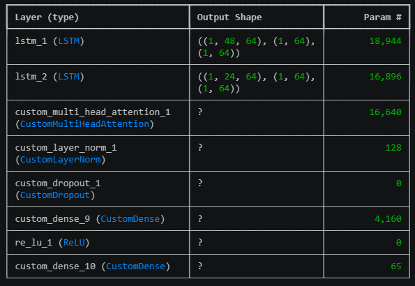

# ₿ Bitcoin Price Forecasting using Seq2Seq Deep Learning

### Multivariate Multi-Horizon Time Series Forecasting with TensorFlow

<p align="center">


</p>

---

## 🎯 Project Summary

This project implements a deep learning-based Bitcoin price forecasting system using a Sequence-to-Sequence (Seq2Seq) architecture enhanced with Multi-Head Attention and Teacher Forcing.

The proposed model was designed to perform multi-horizon forecasting and was benchmarked against a baseline LSTM forecasting model.

### Key Result

🚀 **50.36% MAE Improvement over Baseline LSTM**

| Metric | Baseline LSTM | Seq2Seq |
| ------ | ------------- | ------- |
| MAE    | 327.68        | 162.67  |
| RMSE   | 469.40        | 211.40  |

---

## 🚀 Project Highlights

✔ Developed a custom Seq2Seq Encoder–Decoder architecture using TensorFlow

✔ Implemented Teacher Forcing to improve decoder training stability

✔ Built a custom Multi-Head Attention mechanism for sequence modeling

✔ Designed custom training loops using TensorFlow GradientTape

✔ Achieved over 50% MAE improvement compared to a baseline LSTM model

✔ Performed multi-horizon forecasting and forecast degradation analysis

✔ Evaluated forecasting performance using MAE and RMSE metrics

---

## 📈 Forecast Visualization

The figure below compares actual Bitcoin prices against predictions generated by the proposed Seq2Seq forecasting model.


The model successfully captures overall market trends and demonstrates improved forecasting accuracy compared to the baseline approach.

---

## 📊 Model Performance Comparison

### Mean Absolute Error (MAE)


### Root Mean Squared Error (RMSE)


The proposed Seq2Seq model consistently outperformed the baseline LSTM model across both evaluation metrics.

---

## 🔍 Horizon Error Analysis

To evaluate long-range forecasting robustness, prediction errors were analyzed across multiple forecasting horizons.


This analysis provides additional insight into how forecasting performance changes as the prediction horizon increases.

---

## 🏗 Model Architecture

The forecasting model combines a Seq2Seq Encoder–Decoder framework with a custom Multi-Head Attention mechanism.



### Architecture Components

* Encoder Network
* Decoder Network
* Teacher Forcing Strategy
* Multi-Head Attention Layer
* Multi-Horizon Forecast Output

---

## 📂 Dataset

The project utilizes historical Bitcoin market data containing multiple numerical variables used to forecast future price movements.

### Data Processing Pipeline

* Data Cleaning
* Feature Engineering
* Correlation Analysis
* Seasonal Decomposition
* ACF & PACF Analysis
* Feature Scaling
* Sequence Windowing
* TensorFlow Dataset Pipeline

---

## 📊 Correlation Analysis

Correlation analysis was performed to understand relationships between market variables before model training.


This step supports feature selection and exploratory data analysis for forecasting tasks.

---

## ⚙️ Training Strategy

### Baseline Model

* LSTM Forecasting Network
* Multi-Horizon Prediction
* Custom Training Loop

### Advanced Model

* Seq2Seq Encoder–Decoder
* Teacher Forcing
* Multi-Head Attention
* Layer Normalization
* Dropout Regularization
* Weighted Horizon Loss

### Optimization

* Adam Optimizer
* TensorFlow GradientTape
* Custom Training Loops
* Validation Monitoring

---

## 📈 Evaluation Methodology

The models were evaluated using:

* Mean Absolute Error (MAE)
* Root Mean Squared Error (RMSE)
* Recursive Multi-Step Forecasting
* Prediction Comparison
* Forecast Visualization
* Horizon Error Growth Analysis

---

## 🧠 Skills Demonstrated

### Machine Learning & Deep Learning

* Time Series Forecasting
* Deep Learning
* Sequence Modeling
* Multi-Step Forecasting
* Attention Mechanisms
* Encoder–Decoder Architectures

### TensorFlow

* TensorFlow
* GradientTape
* Custom Training Loops
* Model Subclassing
* Custom Layers

### Data Science

* Feature Engineering
* Exploratory Data Analysis
* Correlation Analysis
* Statistical Decomposition
* Forecast Evaluation
* Model Benchmarking

---

## 🛠 Tech Stack

* Python
* TensorFlow
* NumPy
* Pandas
* Matplotlib
* Seaborn
* Scikit-learn
* Statsmodels

---

## 📁 Repository Structure

```text
bitcoin-price-forecasting-seq2seq/
│
├── assets/
│   ├── forecast_vs_actual.png
│   ├── baseline_seq2seq_mae.png
│   ├── baseline_seq2seq_rmse.png
│   ├── horizon_error_analysis.png
│   ├── correlation_heatmap.png
│   └── model_architecture.png
│
├── notebooks/
│   └── Bitcoin_Forecasting.ipynb
│
├── README.md
├── requirements.txt
└── LICENSE
```

---

## 🔮 Future Improvements

Potential enhancements include:

* Transformer-based Forecasting
* Temporal Fusion Transformer (TFT)
* Hyperparameter Optimization
* MLflow Experiment Tracking
* Docker Deployment
* FastAPI Forecasting API
* Real-Time Cryptocurrency Forecast Dashboard
* Model Explainability and Attention Visualization

---

## 👨‍💻 Author

**Muhammad Rizky Abdillah**

Aspiring AI Engineer | Machine Learning Engineer | Deep Learning Enthusiast

GitHub: https://github.com/N0tFuhny

LinkedIn: https://linkedin.com/in/rzkyabdlh
